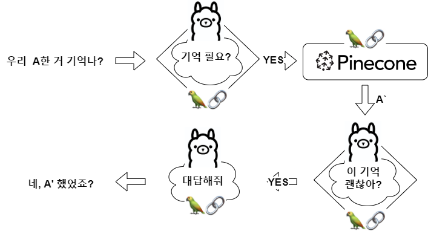
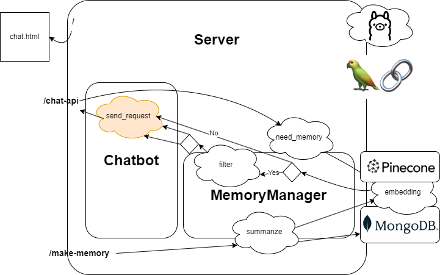
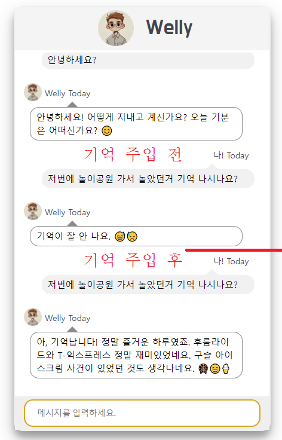
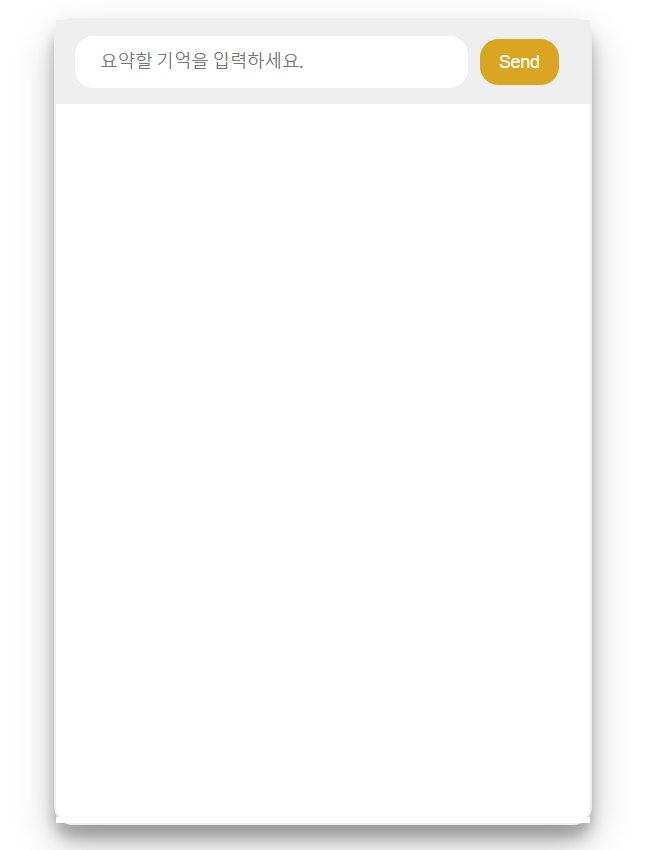

# 카카오 챗봇 만들기

[시연 자료_google slide](https://docs.google.com/presentation/d/1Xgu3ytEaByc1C_hbBj7ccZ5kETswbcycqMETppsvkNE/edit?usp=sharing)

# 구조




# 실행 방법
## Prerequisite
### Ollama 모델 생성
1. [ollama 설치](https://ollama.com/)
2. [EEVE 모델 다운로드](https://huggingface.co/heegyu/EEVE-Korean-Instruct-10.8B-v1.0-GGUF/blob/main/ggml-model-Q4_K_M.gguf)
3. Modelfile 저장
* 아래 내용을 Modelfile 이라는 이름으로 다운받은 모델과 같은 위치에 저장합니다.
```
FROM ggml-model-Q4_K_M.gguf

TEMPLATE """{{- if .System }}
<s>{{ .System }}</s>
{{- end }}
<s>Human:
{{ .Prompt }}</s>
<s>Assistant:
"""

SYSTEM """A chat between a curious user and an artificial intelligence assistant. The assistant gives helpful, detailed, and polite answers to the user's questions."""
```
4. EEVE 모델 생성
```
# modelfile과 모델이 있는 위치에서
ollama create EEVE -f Modelfile
```
### MongoDB 세팅
1. [MongoDB 설치](https://www.mongodb.com/ko-kr/docs/manual/installation/)
2. `chatbot` 클러스터 생성.
3. 해당 클러스터에 `chats`, `memory` Collection 생성

### Pinecone 세팅
1. Pinecone 가입
2. API key 발급 후 'PINECONE_API_KEY' 환경변수로 설정

## 실행
1. git root에서 `pip install -r requirements.txt` 로 requirement 다운로드
2. `app/main.py` 실행
3. `localhost:3000` 으로 접속해 채팅

## 실행 포인트
1. 일상 대화
2. 기억 물어보기
3. 관련 기억 생성후 기억 물어보기




* 예시에서 사용한 기억
```
웰리와 경현이는 여름에 애버랜드라는 놀이공원에 가서 재밌게 놀았다. 후룸라이드, T-익스프레스가 특히 스릴있었다. 웰리가 구슬 아이스크림을 한 번 엎어서 치우느라 고생했다.
```


# 개발환경
CPU/GPU: AMD Ryzen 5 5625U with Radeon Graphics 2.30 GHz (x64)
RAM : 24.0GB
OS: Window 10 Pro

Python 3.11.9
requirements.txt